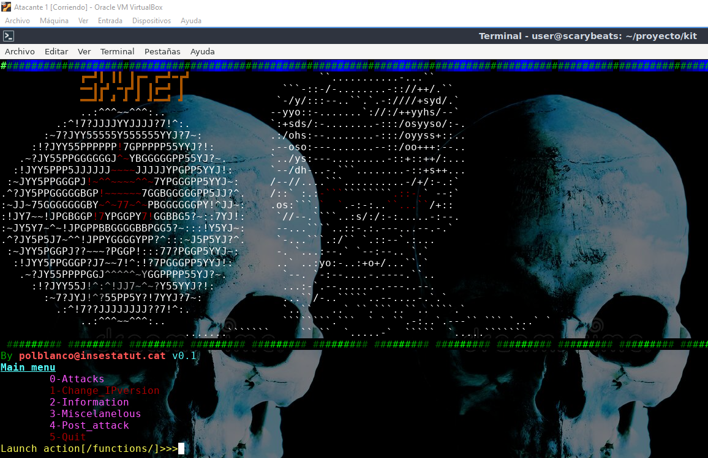

# Skynet

Skynet is a hacking tool to scale privileges inside any LAN. It uses some exploits to take down legitimate network DHCP server and succesfully replace it by a rogue DHCP server, and then start spoofing another important network services like DNS and HTTP.

## Responsibility and Legal Disclaimer

**Important: This script is provided for educational and testing purposes only. Misuse of this script may have legal and ethical consequences. The author is not responsible for any damage caused by the misuse of this script. By using this script, you accept full responsibility for your actions.**

## Project state

The development of this project is in pause. It's functional, but there are few tasks that can be more automatized, like website phishing, and there are few level 0 attacks deprecated.

## Installation and Usage Instructions

### Installation

This tool is only available now for linux hosts. In a future probably it can be used in windows too.
To install it, execute this in your terminal:

Claro, aquí tienes un ejemplo de un bloque de código en Bash para un archivo README.md:

```bash
git clone https://github.com/n4s3r/skynet.git
cd skynet
chmod +x requirements
chmod +x skynet
sudo ./requirements
```
If your linux it's not configured to be able to be used like a router, you'll need to execute this:
```bash
# To enable IP forwarding
echo 'net.ipv4.ip_forward=1' | sudo tee -a /etc/sysctl.conf
sudo sysctl -p
# To configure NAT
sudo iptables -t nat -A POSTROUTING -o eth0 -j MASQUERADE
sudo sh -c 'iptables-save > /etc/iptables/rules.v4'  # To do it persistent

```

### Usage

It is highly recomended to execute it in a clean virtual machine, to avoid problems with changing the MAC, and avoid problems with dhclient files (some files can become corrupted).

## Documentación Adicional

Enlaces a documentación más extensa si es necesario.

## Configuración

Instrucciones para configurar o personalizar el proyecto.

## How to contribute

Pautas claras sobre cómo los usuarios pueden contribuir al proyecto.

## Feature Requests
Have an idea for a new feature? Submit a feature request and use our template to provide the necessary details.

## Documentation Contributions
Feel free to improve or expand our documentation. Make changes in the `docs` directory.

## Licencia

Información sobre la licencia del proyecto.

## Reconocimientos

Agradecimientos a personas o proyectos que han contribuido o inspirado el proyecto.

## Estado del Proyecto y Soporte

Información sobre el estado actual del proyecto y cómo obtener soporte.

## Ejemplos/Capturas de Pantalla

Capturas de pantalla o ejemplos visuales del proyecto.

## Etiquetas y Badges

Badges que resaltan información importante.

